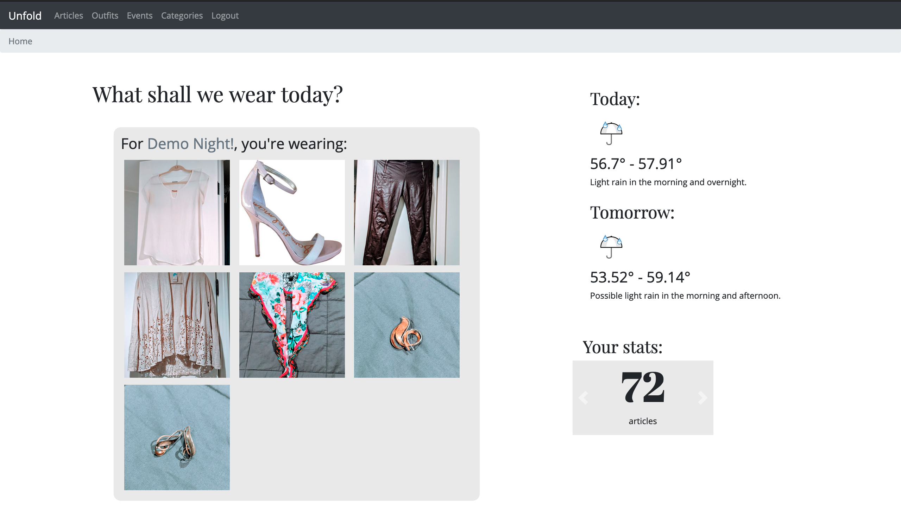
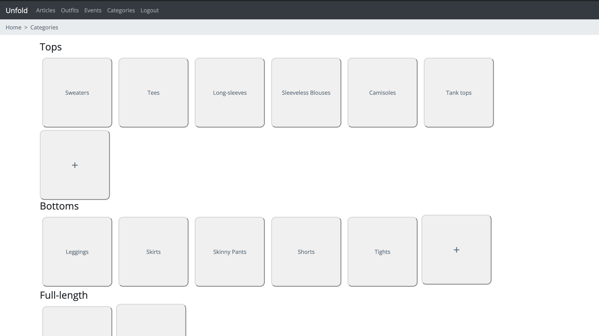
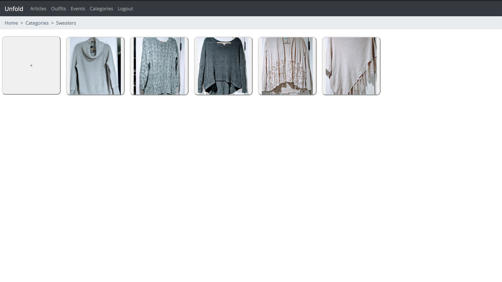
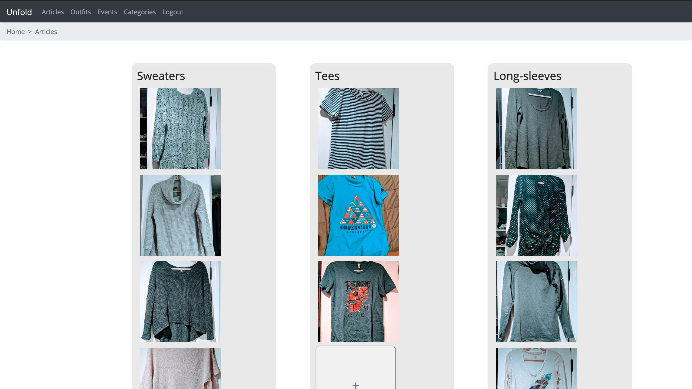
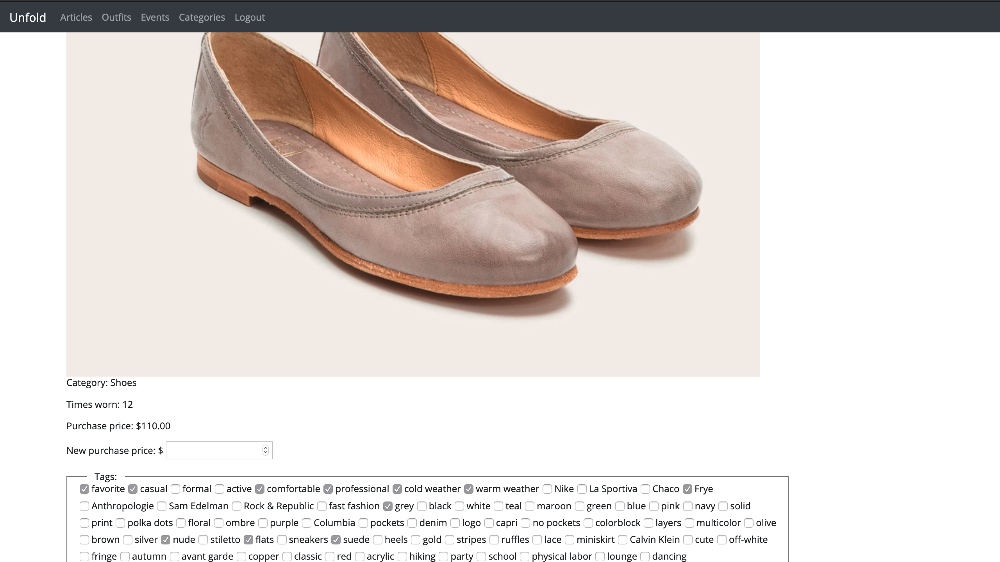
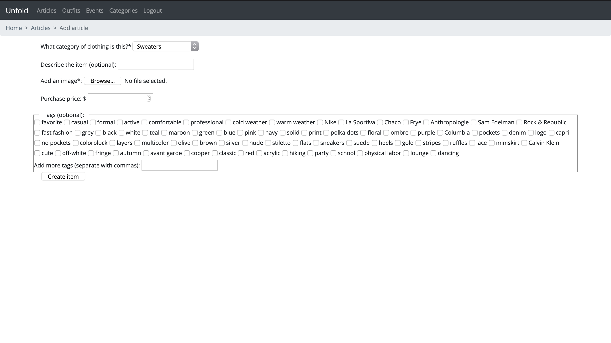

# Unfold

Rediscover joy in your closet. Easily choose what to wear with personalized outfit recommendations that use event tags, weather, and user's wear logs.

See all your clothes in one place, catalog and combine clothing articles into outfits, and log outfits worn to see statistics and receive recommendations.

## Homepage

If a user has logged an event for the day, it will appear on the homepage along with an outfit recommendation for each event (or the assigned outfit for each event.) Here you will also see a weather preview supplied by the DarkSky API for today and tomorrow, along with a carousel of user stats like total articles, best value outfit, and most popular tags. 

## Categories

Categories are user-created, but inherit from base categories like "Tops", "Hats", "Full-Length", and "Outerwear". 

Selecting an individual category shows all articles belonging to the category.

## Articles

Articles are displayed by category, and categories are sorted by base category. Each thumbnail is a link to an article detail view.

## Article Details

The article detail view shows the article description if provided, the image, purchase price, and tags. The user can update article details as well.

## Article Creation

# About the Developer

Athelia changed careers to launch a career of creative problem solving, growth, and new challenges. Prior to becoming a SWE student, she worked for a building materials company in a variety of roles, from doing document design and copywriting in the Marketing department to producing the price list and pricing tools in the Sales & Bid Center. For the latter, she developed an automated tool to produce quotes on behalf of sales representatives, reducing errors both in calculation and data entry, and eliminating repetitive calculations. Athelia looks forward to using her experience with this project and her new skills gained through Hackbright to explore even more complex problems and create more tools that will improve people's lives.

